# 👋 Olá! Eu sou o Jhony

<div align="center">
  
  
  
</div>

---

## 🚀 Sobre Mim

> **"Desenvolver não é só escrever código - é criar soluções que realmente impactam a vida das pessoas"**

🔹 **QA Engineer** na ŌKEA - Testando sistemas e APIs diariamente  
🔹 **5 anos** liderando equipes comerciais  
🔹 **Em transição** para Full Stack Developer  
🔹 **Paixão** por resolver problemas complexos através do código  

### 🎯 Minha Jornada Única

```mermaid
graph LR
    A[👔 5 anos<br/>Liderança Comercial] --> B[🔍 QA Engineer<br/>ŌKEA]
    B --> C[💻 Full Stack<br/>Developer]
    
    A -.->|Entender necessidades<br/>do cliente| D[🎯 Visão de Negócio]
    B -.->|Qualidade e<br/>robustez| E[⚡ Código Limpo]
    D --> C
    E --> C
```



**Por que essa combinação é poderosa?**
- **Vendas**: Me ensinou a entender o que o cliente *realmente* precisa
- **QA**: Me deu visão única de como construir aplicações mais sólidas
- **Desenvolvimento**: Onde posso unir tudo isso criando soluções impactantes

---

## 🌐 Socials:
[](https://instagram.com/jhonydupe) [](https://linkedin.com/in/jhonypereiraduarte) [](mailto:jhonyfrontend@outlook.com)

---

## 💻 Tech Stack:
           

---

## 🎯 O Que Me Move

```typescript
const jhony = {
  mentalidade: "Growth Mindset",
  missao: "Criar soluções que fazem diferença na vida das pessoas",
  valores: ["Código Limpo", "Trabalho em Equipe", "Impacto Real"],
  proximoNivel: "Full Stack Developer",
  
  transformarProblemaEmSolucao() {
    return this.experienciaComercial + this.visaoQA + this.paixaoPorCodigo;
  }
};
```

### 🌟 Diferenciais

- **🧠 Visão de Negócio**: 5 anos entendendo necessidades reais do cliente
- **🔍 Olhar Crítico**: QA me ensinou a pensar em edge cases e robustez  
- **🤝 Liderança**: Experiência comprovada em gestão de equipes
- **💡 Problem Solver**: Paixão por transformar problemas complexos em soluções elegantes

---

## 📊 GitHub Stats:
<br/>
<br/>


---

## 🏆 GitHub Trophies


---

### 🔝 Top Contributed Repo


---

<div align="center">
  
  ### 💭 "A melhor maneira de prever o futuro é criá-lo através do código"
  
  **Aberto a novas oportunidades • Vamos construir algo incrível juntos! 🚀**
  
</div>

---

[](https://visitcount.itsvg.in)
